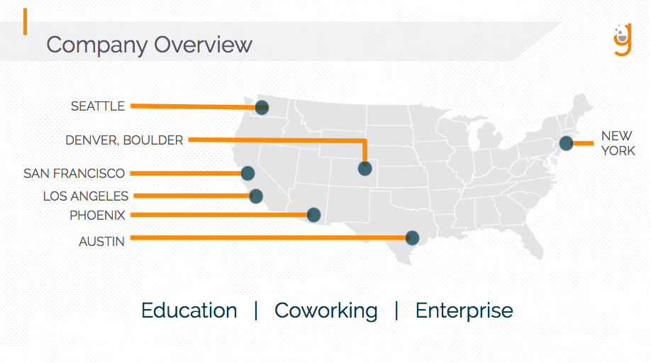

# Learn to Code: Introduction to Data Science with Python

<!---->

Learn more Data Science with the [Galvanize Data Science Prep Course](http://bit.ly/gprepdata) - FREE | study at your own pace

Get to this repo by typing in URL: **datapy.sage.codes**

### FAQ: 

- WIFI: `Galvanize Guest` | Password: Posted on the walls
- Bathrooms: Behind you down the hall to the left
- Kitchen outside back classroom door with Coffee & Tea!
- Snacks + water in back of room

## Overview
The goal of this brief course is to provide you with a fun introduction to the world of Data Science with Python.

#### Here's what we'll be doing:
* Overview of basic Python and programming concepts
* Building a simple application using Python
* Playing around and break things

## Setting up your computer

#### Please set up the following:

* A web browser to see what we're working on as others see it (Recommend Google Chrome: [chrome.google.com] (http://chrome.google.com))

* We're going to use [Google Colab](colab.research.google.com) so you will need a Google account if you want to save your own copy.

Well... that was easy! 

## What this workshop is

A super friendly introduction to Python No previous experience expected! 

You can't learn EVERYTHING in ~2 hours. But you can learn enough to get excited and comfortable to keep working and learning on your own! I will link to some resources, and I can email them to you later!

- This course is for absolute beginners
- Ask Questions!
- Answer Questions!
- Help others when you can
- Its ok to get stuck, just ask for help!
- Feel free to move ahead
- Be patient and nice

## About me:

Hello I'm [Sage Elliott](http://sageelliott.com/). I'm a Technology Evangelist here at Galvanize! For the past decade I've worked as a software and hardware engineer with Startups and Agencies in Seattle, WA and Melbourne, FL. I love making things with technology! 

**Note:** I'm not a Galvanize Instructor, they're way better at teaching! 

Reach out to me if interested in:

- breaking into the tech industry 
- learning resources
- meetup recommendations 
- learning more about Galvanize
- giving me suggestions for events!
- being friends

- Website: [sageelliott.com](http://sageelliott.com/)
- Twitter: [@sagecodes](https://twitter.com/@sagecodes)
- LinkedIn: [sageelliott](https://www.linkedin.com/in/sageelliott/) 
- Email: [sage.elliott@galvanize.com](mailto:sage.elliott@galvanize.com)

## About you!

Give a quick Intro!

- Whats your name?
- Whats your background?
- Why are you interested in Data Science?

## What is Data Science?

Great question! 

Different Companies and people will have different definitions for roles.

In general I like to broadly think of it as "Solving problems using data". 

- Data Collection and storage
- Data Cleaning, prepping
- Analytics, Metrics, gaining insights
- A/B Testing
- AI
	- Machine Learning
	- Deep Learning 

Understanding the business problem is important for each step above.

### Jobs in Data Science

- The Data Analyst
- The Data Engineer
- The Data Science
- Machine Learning Engineer
- Deep Learning Engineer
- Computer Vision Engineer
- Natural Language Processing(NLP) Engineer
- More!

### Who uses Python?

I would say most major companies using Data Science and machine learning. 

Other Languages: Scala, R

#### Popular Frameworks and libraries to keep in mind

- Data Science
	- Pandas 
	- MatplotLib
	- seaborn
	- Tensorflow
	- Keras
	- Numpy
	- Pandas
	- ScikitLearn
	- OpenCV
	- pytorch
	- A BILLION MORE!

*Note*: if you're thinking of exploring data science with python look into using [Anaconda](https://www.anaconda.com/) to manage your python and data libraries

[Google Colab](https://colab.research.google.com/notebooks/welcome.ipynb#recent=true) is a awesome place to start as well without having to install anything!

## What we'll do!

We're going to:

- Understand a dataset
- Visualize the data in a meaningful way
- Use Machine learning to make predictions

For this we're going to use:

- Pandas 
- Matplotlib
- ScikitLearn

## Follow along and code in Google colab

### [Intro to data Science with Python Google Colab](https://colab.research.google.com/drive/1_bszcUFMGvzo8hza-2vPJQQmx2kde7T8)

### URL: dsco.sage.codes

### Keep learning!

I'll email these out to attendees with email addresses!

More learning resources:

- [Galvanize Data Science Prep Course](http://bit.ly/gprepdata) - FREE | study at your own pace

- [Hack Reactor Software Engineer Prep](http://bit.ly/gsoftprep) FREE | study at your own pace

- [Datacamp](https://www.datacamp.com/courses/intro-to-python-for-data-science) | Some Free

- [Udacity Intro to Data Science](https://www.udacity.com/course/intro-to-data-science--ud359) | Free

## Upcoming Events!

Visit the [Learn to code Seattle](https://www.meetup.com/Learn-Code-Seattle/) meetup for all upcoming events.

- [Intro to Data Science with Python](https://www.eventbrite.com/e/intro-to-data-science-with-python-tickets-58878207303) - 4/18 630pm
- [Intro to React](https://www.eventbrite.com/e/intro-to-react-tickets-58878540299) - 4/24 6:30pm
- [SQL 101](https://www.eventbrite.com/e/sql-101-tickets-58878275507) - 4/25 630pm
- [JavaScript Mini Bootcamp: Fundamentals II](https://www.eventbrite.com/e/javascript-mini-bootcamp-fundamentals-ii-tickets-58878315627) - 4/27 10am - 430pm
- [Intro to Web Scraping for Data Science](https://www.eventbrite.com/e/intro-to-web-scraping-with-python-for-data-science-tickets-58878488143) 5/2 6:30pm

# What is Galvanize?

> We create a technology ecosystem for learners, entrepreneurs, startups and established companies to meet the needs of the rapidly changing digital world.

- Education
- Co-Working
- Events
- Enterprise

## Galvanize Classes

#### Immersive Bootcamp

Transform your career with our 13 week immersive programs

- [Software Engineer](http://bit.ly/seawebdev) - 6/3/19 - 10/11/19
- [Data Science](http://bit.ly/seadatascience) - 5/6/19 - 8/2/19

#### Part-Time Courses

Learn while working with out evening part-time classes

- [Intro to Data Science](http://bit.ly/seaintrods) - 5/7/19 - 6/27/19

- [Digital Marketing](http://bit.ly/seadm) - 5/13/19 - 7/3/19

- [Data Analytics](http://bit.ly/seadataa) - 5/6/19 - 7/24/19

#### Co-working Space

[work in our building!](https://www.galvanize.com/entrepreneur)

## Questions

Please feel free to reach out to me with any questions! Let me know what you're planning to do next and how I can help!

- Website: [sageelliott.com](http://sageelliott.com/)
- Twitter: [@sagecodes](https://twitter.com/@sagecodes)
- LinkedIn: [sageelliott](https://www.linkedin.com/in/sageelliott/) 
- Email: [sage.elliott@galvanize.com](mailto:sage.elliott@galvanize.com)

